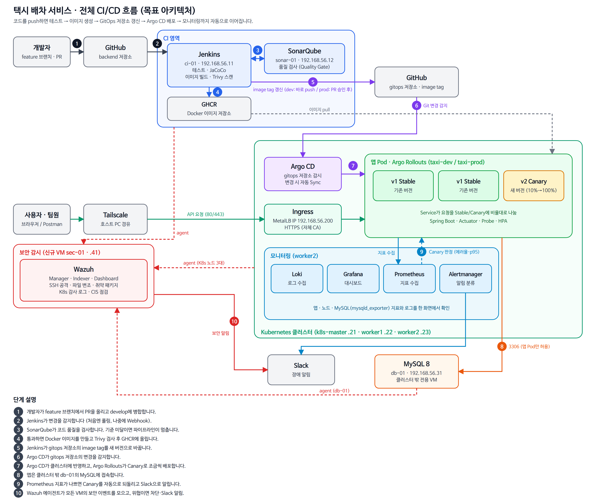
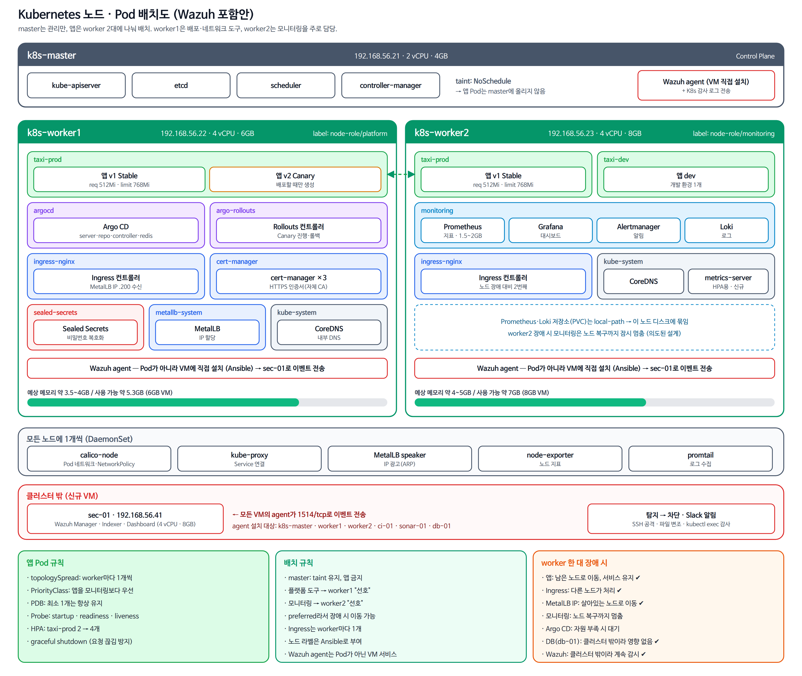
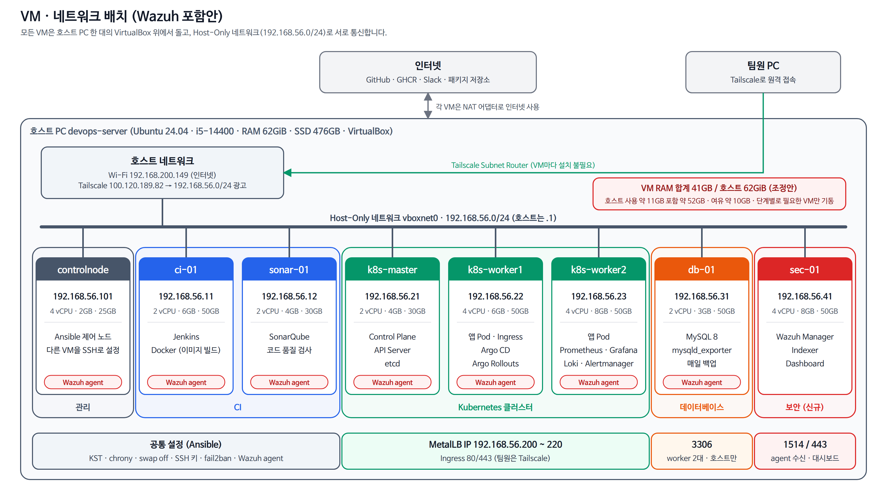

# 아키텍처 개요

> 원본: 노션 「아키텍처 개요」에서 2026-09-30 기준으로 옮김.

> 📌 **상태: 회의 전 초안** · 기준일 2026-09-30 · 목표(To-be) 아키텍처 문서. 현재 상태는 [「현재 환경 현황」](current-environment.md) 문서 참고.
>
> 범례: ✅ 결정 · 💡 제안(회의에서 확인) · ❓ 미정
>
> 문서 원본: 현재는 노션. docs 저장소(DevOps_Docs) 이전 여부는 13장 안건에서 결정 ❓. 이전이 확정되면 이 문구와 `CLAUDE.md`의 「설계 원본은 Notion」 문구를 함께 갱신.

## 1. 프로젝트 개요

택시 배차 서비스(Spring Boot 백엔드)를 개발하고, 이를 자동으로 검증·빌드·배포·감시하는 DevOps 파이프라인을 구축.

> 💬 **한 줄로 말하면:** 개발자가 코드를 GitHub에 올리기만 하면, 테스트 → 품질 검사 → 이미지 생성 → 배포 → 감시까지 사람 손을 거의 거치지 않고 진행되게 만드는 프로젝트. 새 버전에 문제가 있으면 자동으로 이전 버전으로 되돌림.

| 트랙 | 내용 |
| --- | --- |
| 앱 | 사용자·기사·차량·호출 CRUD와 호출 → 수락 → 도착 → 시작 → 완료/취소 흐름. Java 21, Spring Boot, MySQL 8, Flyway |
| 인프라 | Jenkins CI, GitOps(Argo CD), Canary 배포(Argo Rollouts), Prometheus·Grafana 모니터링 |
| 실행 환경 | 개인 PC 한 대 위의 VirtualBox VM (클라우드 비용 없음) |
| 보안 💡 | Wazuh(SIEM)로 모든 VM의 보안 이벤트(로그인 공격, 파일 변조, 취약 패키지, K8s 감사 로그)를 수집·탐지·대응. 별도 VM sec-01에 설치 (9장 「Wazuh 보안 감시」 참고) |

## 2. 전체 그림





위 그림 2장은 ① 전체 CI/CD 흐름(Wazuh 포함안, 번호 1~10)과 ② Kubernetes 노드·Pod 배치(Wazuh 포함안, 3장 「노드·Pod 배치」 참고). Wazuh 관련 부분(빨간색)은 💡 제안 상태.

첫 번째 그림은 크게 네 부분으로 나눠 읽으면 쉬움.

| 부분 | 그림 속 번호 | 하는 일 | 쉽게 말하면 |
| --- | --- | --- | --- |
| **CI** (지속적 통합) | 1 ~ 4 | 코드를 테스트하고 품질을 검사한 뒤 Docker 이미지로 만들어 GHCR에 저장 | "이 코드, 배포해도 되는 상태인가?"를 확인하고 포장까지 하는 단계 |
| **CD** (지속적 배포) | 5 ~ 7 | gitops 저장소의 이미지 버전을 바꾸면 Argo CD가 클러스터에 반영 | "포장된 새 버전을 실제 서버에 올리는" 단계 |
| **운영** | 8 ~ 9 | 앱이 DB를 사용하고, Prometheus가 상태를 감시하며 문제가 생기면 Slack으로 알림 | "잘 돌아가는지 지켜보고, 이상하면 되돌리고 알려주는" 단계 |
| **보안 감시** 💡 | 10 | Wazuh agent가 모든 VM의 보안 이벤트를 sec-01로 보내고, 위협이면 차단하고 Slack으로 알림 | "누가 나쁜 짓을 하는지 지켜보고 막는" 단계 |

사용자 요청은 그림 왼쪽 아래의 초록 화살표를 따라감. 사용자·팀원 → Tailscale(호스트 PC 경유) → Ingress(MetalLB IP) → 앱 Pod 순서.

## 3. 물리 구성



호스트 PC는 Ubuntu 24.04, i5-14400(10코어/16스레드), RAM 62GiB, NVMe SSD 476GB(가용 약 395GB). 이 PC 한 대 안에 VirtualBox로 가상 서버(VM) 7대를 띄움. Wazuh를 도입하면 sec-01을 더해 8대 💡.

| VM | 역할 | vCPU | RAM | 디스크 | Host-Only IP | 상태 |
| --- | --- | --- | --- | --- | --- | --- |
| controlnode | Ansible 제어 노드 | 4 | 2GB 💡 (기존 4GB) | 25GB | 192.168.56.101 | 기존 유지 ✅ |
| ci-01 | Jenkins, Docker | 2 | 6GB 💡 | 50GB | 192.168.56.11 | 신규 ✅ |
| sonar-01 | SonarQube | 2 | 4GB | 30GB | 192.168.56.12 | 신규 ✅ |
| k8s-master | Kubernetes Control Plane | 2 | 4GB | 30GB | 192.168.56.21 | 신규 ✅ |
| k8s-worker1 | 앱, Ingress, Argo CD | 4 | 6GB 💡 | 50GB | 192.168.56.22 | 신규 ✅ |
| k8s-worker2 | 앱, 모니터링 | 4 | 8GB | 50GB | 192.168.56.23 | 신규 ✅ |
| db-01 | MySQL 8 전용 | 2 | 3GB 💡 | 50GB | 192.168.56.31 | 신규 ✅ |
| sec-01 | Wazuh Manager · Indexer · Dashboard | 4 | 8GB | 50GB | 192.168.56.41 | 신규 💡 |

- 위 표는 **자원 조정안** 기준 💡. 8대 합계 RAM **41GB**(조정 전 48GB), 디스크 상한 310GB(동적 할당). 호스트 자체 사용량(약 11GB)을 더해도 호스트 RAM(62GiB)에 약 10GB 여유를 남김. 자세한 내용은 아래 「자원 운영 방안」.
- ci-01은 Jenkins 힙과 Gradle 힙을 제한해서 6GB로 운영하고, 빌드 중 OOM이 나면 8GB로 복귀 💡.
- VM은 **Vagrant + VirtualBox**로 생성 ✅. OS는 Ubuntu 24.04 LTS, 시간대는 KST ✅, swap은 해제(kubeadm 요구사항).
- Kubernetes는 kubeadm + containerd, 노드는 master 1 + worker 2. Control Plane 다중화는 하지 않음 ✅.
- 기존 managednode1·2와 등록되지 않은 ubuntu-server-02 폴더(4.4GB)는 삭제 ✅.

**자원 운영 방안 💡** (팀 합의 전 제안)

결론: **VM 스펙을 조금 줄이고, 단계별로 필요한 VM만 켜는 방식**을 함께 사용.

- **줄이는 이유:** 조정 전 합계는 VM 48GB + 호스트 자체 사용 약 11GB = 약 59GB로, 호스트 RAM 62GiB에 거의 꽉 참. VirtualBox는 기본 설정에서 게스트가 쓴 메모리를 호스트에 돌려주지 않고, 게스트 Linux는 남는 RAM을 캐시로 채우므로 시간이 지나면 할당량 전체를 쓰는 것처럼 동작함. 그래서 할당량 합계를 호스트 RAM보다 **최소 10GB 이상 여유** 있게 잡는 것이 목표.

**① VM 스펙 조정 (합계 48GB → 41GB)**

| VM | 조정 전 | 조정안 | 근거 |
| --- | --- | --- | --- |
| controlnode | 4GB | **2GB** | 유휴 사용량 약 450MB, Ansible만 실행 |
| ci-01 | 8GB | **6GB** | Jenkins 힙과 Gradle 힙을 제한하면 가능. 빌드 중 OOM이 나면 8GB로 복귀 |
| sonar-01 | 4GB | 4GB (유지) | 내부 검색엔진(Elasticsearch) 때문에 줄이면 불안정 |
| k8s-master | 4GB | 4GB (유지) | Control Plane과 etcd 안정성이 우선 |
| k8s-worker1 | 8GB | **6GB** | 앱, Ingress, Argo CD, Rollouts로 모니터링보다 가벼움 |
| k8s-worker2 | 8GB | 8GB (유지) | Prometheus, Grafana, Loki, Alertmanager가 가장 무거움 |
| db-01 | 4GB | **3GB** | `innodb_buffer_pool_size`를 1GB 정도로 두면 충분 |
| sec-01 | 8GB | 8GB (유지) | Wazuh 권장 최소 사양이 4vCPU/8GB(소규모 agent)로 알려져 있어 줄이지 않음. 설치 전 공식 문서로 재확인 |
| **합계** | **48GB** | **41GB** | 호스트 여유 약 10GB |

- sec-01은 줄이지 않고, 다른 VM에서 7GB를 줄여 확보.
- vCPU 합계는 24개(controlnode 4 포함)로 호스트 16스레드보다 많음. 유휴 상태에서는 문제없지만, 빌드와 Sonar 분석을 동시에 돌리면 느려질 수 있음.

**② 단계별로 켜기 (효과가 가장 큼)**

8대가 모두 동시에 필요한 시점은 시연 때뿐. 로드맵 단계별로 필요한 VM만 켬.

| 단계 | 켜 둘 VM | 대략 RAM |
| --- | --- | --- |
| 1~2단계 (K8s, DB 구축) | controlnode, k8s 3대, db-01 | 2+4+6+8+3 = **23GB** |
| 3~4단계 (CI, CD) | 위 + ci-01, sonar-01 | **33GB** |
| 5단계 (모니터링) | 위와 동일 (worker2 부하 증가) | 33GB |
| Wazuh 작업·시연 | 필요한 VM + sec-01 | 최대 **41GB** |
| 최종 시연 | 전부 | 41GB |

- 안 쓰는 VM은 `vagrant halt <이름>`으로 끄고, 필요할 때 `vagrant up <이름>`으로 켬.
- Vagrantfile에서 ci-01, sonar-01, sec-01에 `autostart: false`를 걸어 두면, 처음 `vagrant up` 때 필요한 VM만 올라옴.
- `vagrant snapshot save base-clean`으로 스냅샷을 찍어 두면 끄고 켜기와 실험 후 복구가 쉬움.

**③ 호스트에서 여유 확보**

현재 호스트 사용량 약 11GB에는 개발용 프로세스가 포함됨(IntelliJ, 호스트 로컬 MySQL, Docker, 8080 Java 앱).

- VM을 많이 켤 때는 호스트 로컬 MySQL, Docker, Java 앱을 끔. 대략 3~5GB 확보(추정).
- db-01에 MySQL이 생기므로 호스트 로컬 MySQL은 K8s 단계부터 필요 없음.
- 가능하면 시연 때는 IntelliJ도 닫음.

**④ VM 안에서 메모리 상한 설정 (Ansible에서 처리)**

자바 계열이 할당량을 다 쓰지 않도록 상한을 명시. 수치는 제안값이며 실제 사용량을 보고 조정.

| VM | 설정 | 값(제안) |
| --- | --- | --- |
| ci-01 | Jenkins JVM `-Xmx` | 1GB |
| ci-01 | Gradle `org.gradle.jvmargs` | `-Xmx1g` |
| sonar-01 | `vm.max_map_count` | 262144 이상 필수 (없으면 Elasticsearch 기동 실패). SonarQube 버전별 요구값은 설치 시 공식 문서로 확인 |
| sec-01 | `vm.max_map_count` | 262144 (Wazuh Indexer도 필요) |
| sec-01 | Indexer 힙 | 기본값 확인 후 조정 |
| db-01 | `innodb_buffer_pool_size` | 1GB |
| k8s-worker2 | Prometheus 보존 기간 | 짧게 (예: 3~7일). Loki는 마지막 단계에 도입 |

**⑤ 부족할 때 늘리는 순서**

각 VM과 호스트에서 `free -h`로 확인하면서 아래 순서로 조정.

1. ci-01: 빌드 중 OOM이 나면 6GB에서 8GB로 복귀.
2. k8s-worker1: 6GB에서 8GB로 복귀.
3. 호스트가 swap을 쓰기 시작하면(호스트 swap 8GiB), 안 쓰는 VM부터 `halt`.

**⑥ Vagrantfile 반영 예시**

```ruby
VMS = [
  { name: "ci-01",       ip: "192.168.56.11", cpus: 2, memory: 6144, autostart: false },
  { name: "sonar-01",    ip: "192.168.56.12", cpus: 2, memory: 4096, autostart: false },
  { name: "k8s-master",  ip: "192.168.56.21", cpus: 2, memory: 4096, autostart: true  },
  { name: "k8s-worker1", ip: "192.168.56.22", cpus: 4, memory: 6144, autostart: true  },
  { name: "k8s-worker2", ip: "192.168.56.23", cpus: 4, memory: 8192, autostart: true  },
  { name: "db-01",       ip: "192.168.56.31", cpus: 2, memory: 3072, autostart: true  },
  { name: "sec-01",      ip: "192.168.56.41", cpus: 4, memory: 8192, autostart: false },
]
# config.vm.define vm[:name], autostart: vm[:autostart] do |node| ...
```

- controlnode는 기존 VM이라 Vagrant 밖에서 관리. VM을 끈 상태에서 VirtualBox로 RAM을 4GB에서 2GB로 직접 변경: `VBoxManage modifyvm ubuntu-server-01 --memory 2048` (VirtualBox 등록 이름은 `ubuntu-server-01`).
- 조정안이 확정되면 로드맵 문서의 VM 수·스펙과 VM 배치 그림도 함께 갱신.

**노드·Pod 배치** (2장 두 번째 그림)

- **k8s-master:** Control Plane만. taint(NoSchedule)를 유지해서 앱 Pod는 올리지 않음.
- **k8s-worker1:** 배포·네트워크 도구(Argo CD, Argo Rollouts, Ingress, cert-manager, Sealed Secrets, MetalLB) + 앱 Pod.
- **k8s-worker2:** 모니터링(Prometheus, Grafana, Alertmanager, Loki) + 앱 Pod + metrics-server(HPA용).
- 앱 Pod는 topologySpread로 worker마다 1개씩 분산. 도구 배치는 "선호(preferred)"라서 노드 장애 시 다른 노드로 이동 가능.
- worker 한 대 장애 시: 앱·Ingress는 남은 노드에서 유지, 모니터링은 저장소(local-path)가 노드에 묶여 복구까지 멈춤(의도된 설계).
- Wazuh agent는 Pod가 아니라 각 VM에 직접 설치하는 서비스 💡.

**이렇게 나눈 이유**

| 구분 | 이유 |
| --- | --- |
| CI(ci-01, sonar-01)를 클러스터 밖에 둠 | 빌드와 코드 분석은 메모리를 많이 써서 앱과 자원을 다툼. 클러스터에 문제가 생겨도 CI는 계속 동작함. |
| Jenkins와 SonarQube를 분리 | SonarQube는 내부 검색 엔진 때문에 메모리를 많이 씀. 한 VM에 두면 빌드가 느려짐. |
| worker 2대 | Pod를 두 노드에 나눠 띄워야 한 노드가 죽었을 때의 복구와 Canary 배포를 보여줄 수 있음. |
| MySQL을 전용 VM(db-01)에 둠 | DB 데이터가 특정 worker 디스크에 묶이지 않고, 클러스터를 다시 만들어도 데이터가 남음. |
| controlnode 유지 | Ansible로 나머지 VM을 한 번에 설정. VM이 망가져도 같은 명령으로 다시 만들 수 있음. |
| Wazuh를 별도 VM(sec-01)에 둠 💡 | Wazuh Indexer(OpenSearch 기반)가 메모리를 많이 씀. 클러스터 안에 두면 앱과 자원을 다투고, 클러스터가 고장 나면 감시도 함께 멈춤. |

## 4. 네트워크

| 구분 | 값 | 비고 |
| --- | --- | --- |
| Host-Only (vboxnet0) | 192.168.56.0/24 | VM 간 통신과 접속용, 호스트는 .1 ✅ |
| VM NAT (어댑터1) | Vagrant 기본 NAT | 인터넷용. VM마다 독립이라 모두 10.0.2.15여도 충돌 없음 ✅ |
| MetalLB IP 풀 | 192.168.56.200–220 | Ingress가 사용할 외부 IP ✅ |
| Pod CIDR | 10.244.0.0/16 | CNI는 Calico 💡 |
| Service CIDR | 10.96.0.0/12 | Kubernetes 기본값 |
| 피해야 할 기존 대역 | 192.168.200.0/22, 172.17.0.0/16, 100.64.0.0/10, 10.0.2.0/24 | LAN, Docker, Tailscale, 기존 NAT Network |

**각 네트워크가 하는 일**

- **Host-Only:** 호스트 PC와 VM들만 쓰는 내부 네트워크. VM끼리는 이 주소(192.168.56.x)로 서로 찾아감.
- **NAT:** VM이 인터넷(GitHub, 패키지 저장소 등)에 나갈 때 쓰는 통로. 밖에서 VM으로 들어오는 용도는 아님.
- **MetalLB:** 클라우드에는 로드밸런서가 있지만 VM 환경에는 없음. MetalLB가 Host-Only 대역의 IP 하나를 Ingress에 붙여서, 그 IP로 서비스에 접속할 수 있게 해 줌.
- **Pod·Service CIDR:** 클러스터 안에서만 쓰는 가상 주소. 기존 대역과 겹치지 않게 정함.

K8s 노드 IP는 반드시 Host-Only 주소로 명시(NAT의 10.0.2.15를 잘못 잡지 않도록).

| 서비스 | 위치 | 포트 | 접근 범위 |
| --- | --- | --- | --- |
| SSH | 모든 VM | 22 | 호스트, Tailscale |
| Jenkins | ci-01 | 8080 | 호스트, Tailscale |
| SonarQube | sonar-01 | 9000 | 호스트, Tailscale |
| Kubernetes API | k8s-master | 6443 | 클러스터 노드, 호스트 |
| MySQL | db-01 | 3306 | worker 2대와 호스트만 |
| mysqld_exporter | db-01 | 9104 | 모니터링(worker)만 |
| Ingress (HTTP/HTTPS) | MetalLB IP | 80, 443 | 호스트, Tailscale |
| Wazuh agent 연결 💡 | sec-01 | 1514/tcp | 모든 VM의 agent |
| Wazuh agent 등록 💡 | sec-01 | 1515/tcp | 모든 VM의 agent (최초 등록 시) |
| Wazuh API 💡 | sec-01 | 55000/tcp | 호스트, Tailscale (관리용) |
| Wazuh Dashboard 💡 | sec-01 | 443 | 호스트, Tailscale |
| Wazuh Indexer 💡 | sec-01 | 9200 | sec-01 내부만 (외부 차단) |

- Wazuh 포트는 공식 문서 기준 기본값이며, 설치 버전에 맞춰 설치 시 재확인 💡.
- **원격 접근:** Tailscale을 사용하고, 호스트를 Subnet Router로 두어 192.168.56.0/24를 광고 💡. 그러면 VM마다 Tailscale을 설치하지 않아도 됨. 팀원은 자기 PC에서 Tailscale만 켜면 VM 주소로 바로 접속 가능.
- 호스트 SSH(22)가 현재 모든 곳에 열려 있어, Tailscale 접속을 확인한 뒤 범위를 좁힘 💡.
- 호스트의 8080 포트는 개발 중인 Java 앱이 쓰고 있으며 새 인프라와 충돌하지 않음.

## 5. CI 흐름 (Jenkins, ci-01)

> 💬 **CI란?** 코드를 합칠 때마다 자동으로 빌드·테스트해서 "깨진 코드"가 쌓이지 않게 하는 것. 이 프로젝트에서는 Jenkins가 그 일을 맡음.

1. 개발자가 feature 브랜치에서 develop 대상으로 PR을 올림.
2. Jenkins가 변경을 감지. 처음에는 폴링, 안정화 후 Webhook(Tailscale Funnel)으로 변경 💡. Jenkins가 사설망에 있어 GitHub가 직접 호출할 수 없기 때문.
3. **PR 단계:** 테스트(Testcontainers로 실제 MySQL)와 JaCoCo 커버리지를 실행. 이미지는 만들지 않음. SonarQube Community는 PR 분석을 지원하지 않아 PR 단계에서는 돌리지 않음.
4. **develop에 merge:** SonarQube 분석과 Quality Gate를 통과하면 Docker 이미지를 빌드(멀티스테이지, non-root). 태그는 `dev-짧은SHA`. Trivy 스캔에서 HIGH 이상 취약점이 나오면 실패 처리하고, 통과하면 GHCR에 push.
5. **main에 릴리스 태그(v1.0.0 형식):** 같은 절차로 `v1.0.0` 태그 이미지를 빌드 후 push.

**단계별 확인 항목**

| 단계 | 도구 | 확인하는 것 | 실패하면 |
| --- | --- | --- | --- |
| 테스트 | Gradle, Testcontainers | 코드가 의도대로 동작하는지. 실제 MySQL 8 컨테이너를 띄워 Flyway 마이그레이션과 호출 흐름까지 확인 | 파이프라인 중단 |
| 커버리지 | JaCoCo | 테스트가 코드의 몇 %를 실행했는지 | SonarQube 기준에 반영 |
| 품질 검사 | SonarQube | 버그 가능성, 보안 취약 코드, 중복, 커버리지 기준 | Quality Gate 실패 → 중단 |
| 이미지 빌드 | Docker | 앱을 실행 가능한 이미지로 포장 | 중단 |
| 보안 스캔 | Trivy | 이미지 안 라이브러리·OS의 알려진 취약점 | HIGH 이상이면 중단 |
| 저장 | GHCR | 검사를 통과한 이미지만 저장 | - |

- Jenkinsfile은 backend 저장소에 포함하고, 빌드는 일회용 Agent에서 실행하며, Jenkins 설정은 JCasC로 코드화 ✅.
- **자격 증명:** GitHub App(backend 체크아웃, gitops push·PR 생성), GHCR push용 PAT, K8s pull용 read 전용 PAT 사용 ✅. Jenkins Credentials 또는 SealedSecret에만 저장하고 코드에는 넣지 않음.

## 6. CD 흐름 (GitOps)

> 💬 **GitOps란?** "지금 서버에 무엇이 떠 있어야 하는지"를 Git 저장소(gitops)에 적어 두고, Argo CD가 그 내용과 실제 클러스터를 계속 비교해서 맞추는 방식. 배포 이력이 Git 커밋으로 남으므로, 문제가 생기면 커밋을 되돌리는 것만으로 롤백 가능.

- gitops 저장소는 main 하나에 overlays 폴더로 환경을 구분 ✅.
- **dev:** Jenkins(봇)가 dev overlay의 image tag를 직접 push하면 Argo CD가 자동으로 Sync해서 taxi-dev에 배포.
- **prod:** Jenkins가 gitops에 PR을 만들고, 사람이 승인·merge하면 Argo CD가 taxi-prod에 Canary로 배포 ✅.
- **Argo CD App of Apps:** 앱, 플랫폼(Ingress, cert-manager, MetalLB), 모니터링을 각각 Application으로 관리 ✅. 루트 Application 하나만 등록하면 나머지가 따라서 설치되므로, 클러스터를 새로 만들어도 한 번에 복구됨.
- **Argo Rollouts Canary:** 10% → 30% → 60% → 100%로 진행하고, 각 단계에서 Prometheus 지표를 조회. 에러율 1% 미만, p95 500ms 이하, Smoke Test 통과가 기준이며 실패하면 자동 롤백 ✅.
- 트래픽이 적으면 지표가 비어 판정이 어려우므로 Smoke Test 또는 부하 생성 Job으로 요청량을 만듦.

**Canary 배포 예시**

| 단계 | 새 버전(v2)이 받는 요청 | 확인 |
| --- | --- | --- |
| 1 | 10% | 에러율·p95가 기준 이내인지 Prometheus로 확인 |
| 2 | 30% | 같은 기준으로 다시 확인 |
| 3 | 60% | 같은 기준으로 다시 확인 |
| 4 | 100% | v2가 새 Stable이 됨 |
| 실패 시 | 0% | 자동으로 v1에 모든 요청을 돌려보냄 (롤백) |

```text
gitops/
├── argocd/          # root-app, apps/ (Application 정의)
├── apps/taxi/
│   ├── base/        # Rollout, Service, Ingress, HPA 등 공통
│   └── overlays/    # dev, prod (개수, 리소스, 도메인, image tag)
├── platform/        # ingress-nginx, cert-manager, MetalLB, monitoring 설정
└── secrets/         # SealedSecret (암호화된 것만)
```

## 7. 앱과 데이터베이스

- Spring Boot는 taxi-dev / taxi-prod namespace에 배포. Actuator + Micrometer로 지표를 노출하고, Liveness/Readiness Probe, 리소스 requests/limits, HPA를 설정 ✅.
- **MySQL 8은 db-01 전용 VM**(클러스터 밖)에 설치 ✅. 스키마는 `taxi_dev`, `taxi_prod`로 나누고 계정도 분리하며, root의 원격 접속은 막음.
- 문자셋은 utf8mb4. 서버 OS 시간대는 KST지만 앱과 DB가 저장·응답하는 시각은 프로젝트 규칙대로 UTC 💡.
- 앱은 selector 없는 Service + Endpoints로 만든 내부 이름 `mysql`을 통해 db-01에 접속. 접속 정보(`DB_USERNAME`, `DB_PASSWORD`)는 환경변수로 받고 Sealed Secrets로 관리 ✅.
- **DB 접근 제한은 두 겹으로 적용:**
  - **db-01 방화벽(ufw):** 3306은 worker 2대(.22, .23)와 호스트만 허용 ✅. Pod가 클러스터 밖으로 나갈 때 출발지 주소가 노드 IP로 바뀌므로(SNAT), db-01은 어느 Pod가 접속했는지 구분하지 못하고 worker IP만 봄.
  - **클러스터 안 NetworkPolicy(egress):** 앱 Pod만 db-01:3306으로 나갈 수 있게 하고 다른 Pod는 차단 💡. Calico처럼 NetworkPolicy를 지원하는 CNI가 필요.
- Flyway는 앱 기동 시 자동 실행하되, Canary 중 v1과 v2가 같은 스키마를 쓰므로 하위 호환 마이그레이션만 작성 💡.

**용어 풀이**

| 용어 | 뜻 |
| --- | --- |
| Liveness Probe | 앱이 멈췄는지 주기적으로 확인. 응답이 없으면 Kubernetes가 컨테이너를 재시작. |
| Readiness Probe | 앱이 요청을 받을 준비가 됐는지 확인. 준비되기 전에는 요청을 보내지 않음. |
| requests / limits | Pod가 보장받을 최소 자원과 넘을 수 없는 최대 자원. |
| HPA | CPU 사용량 등에 따라 Pod 수를 자동으로 늘리고 줄임. |
| selector 없는 Service | 클러스터 밖 서버(db-01)를 클러스터 안에서 `mysql`이라는 이름으로 부를 수 있게 해 줌. 앱 설정에 IP를 직접 적지 않아도 됨. |
| 하위 호환 마이그레이션 | 컬럼 추가처럼 이전 버전 앱이 그대로 동작하는 변경만 하는 것. 컬럼 삭제·이름 변경은 다음 릴리스로 미룸. |

## 8. 관측성과 알림

- kube-prometheus-stack(Prometheus, Alertmanager, Grafana)과 ServiceMonitor로 앱 지표를 수집 ✅.
- Loki + Promtail로 로그를 모으고, Grafana에서 지표와 로그를 함께 확인 ✅.
- db-01에는 mysqld_exporter를 설치 ✅.
- **역할 구분 💡:** 서비스 상태(지표·앱 로그)는 Prometheus·Loki, 보안 이벤트(로그인 공격, 파일 무결성, 취약 패키지, K8s 감사 로그)는 Wazuh가 담당. Wazuh 알림도 Slack으로 보내되, 보안 알림은 별도 채널로 분리 💡.
- 알림은 Slack으로 전송. 채널 구조와 담당자는 ❓ 미정이며, Critical과 Warning으로 분류하고 알림마다 Runbook을 둠 ✅.

| 도구 | 역할 |
| --- | --- |
| Prometheus | 앱·노드·DB의 숫자 지표(요청 수, 에러 수, 응답 시간, CPU 등)를 주기적으로 모음. Canary 판정에도 쓰임. |
| Grafana | Prometheus와 Loki의 데이터를 그래프와 대시보드로 보여줌. |
| Loki + Promtail | 각 Pod의 로그를 모아 검색할 수 있게 함. |
| Alertmanager | Prometheus 알림 규칙에 걸린 문제를 정리해서 Slack으로 보냄. |
| mysqld_exporter | MySQL의 상태(연결 수, 쿼리 수 등)를 Prometheus가 읽을 수 있게 내보냄. |
| Wazuh 💡 | 모든 VM의 보안 이벤트를 모아 탐지 규칙과 비교하고, 위협이면 알림·차단(Active Response). 자세한 내용은 9장 「Wazuh 보안 감시」. |

| SLO 항목 | 목표 |
| --- | --- |
| 가용성(비-5xx 응답률) | 99% (30일) ✅ |
| 응답 시간 p95 | 500ms 이하 ✅ |
| 응답 시간 p99 | 1초 이하 (참고 지표) ✅ |

- **SLO:** 서비스가 지켜야 할 품질 목표. 예: "30일 동안 요청의 99%는 서버 오류(5xx) 없이 응답"이라는 뜻.
- **p95 500ms:** 요청 100개 중 95개가 0.5초 안에 응답해야 한다는 뜻.

알림 조건 예시: Pod 재시작 반복, 에러율 급증, MySQL 다운, 디스크 80% 초과, DB 연결 80% 초과.

## 9. 보안과 운영

| 영역 | 내용 |
| --- | --- |
| 접근 | Tailscale, SSH 키 인증(비밀번호 로그인은 키 접속 확인 후 차단), fail2ban ✅ |
| 시크릿 | Sealed Secrets, Jenkins Credentials, ansible-vault ✅ |
| 클러스터 | RBAC 최소 권한, Pod Security Standards, NetworkPolicy, ResourceQuota ✅ |
| 이미지 | Trivy 스캔, non-root, Git SHA 태그(latest 금지) ✅ |
| 시간 | chrony 동기화, VM 시간대 KST ✅ |
| 보안 감시 | Wazuh(탐지·Active Response), agent는 전 VM에 설치 💡 |
| 외부 노출(Webhook) | Tailscale Funnel을 쓰면 Jenkins가 인터넷에 노출됨 → webhook 경로만 공개, GitHub webhook secret 검증, Jenkins 익명 권한 제거·로그인 필수, 노출 경로 접근 로그를 Wazuh로 감시 💡 |

**비슷해 보이는 도구의 역할 구분 💡**

| 비교 | 앞 도구 | Wazuh |
| --- | --- | --- |
| fail2ban ↔ Wazuh | fail2ban: VM 한 대에서 SSH 로그인 실패가 많으면 IP 차단. 기록·화면 없음 | 전 VM 이벤트를 한곳에 모아 탐지하고 Active Response로 차단. 대시보드에서 이력 확인. 도입 시 fail2ban을 유지할지 Wazuh로 대체할지 결정 ❓ |
| Trivy ↔ Wazuh | Trivy: 배포 전 **Docker 이미지** 안의 취약점 검사 | 운영 중 **VM OS**에 설치된 패키지의 취약점 탐지. 서로 겹치지 않고 보완 |

- **Sealed Secrets:** 비밀번호를 암호화한 뒤 Git에 올리는 방식. 클러스터 안의 컨트롤러만 풀 수 있어서 gitops 저장소가 노출돼도 비밀번호는 안전함.
- **ansible-vault:** Ansible 설정에 들어가는 비밀번호를 암호화해 두는 기능.

| 백업 대상 | 주기 | 보관 |
| --- | --- | --- |
| MySQL 전체 백업(mysqldump) | 매일 새벽 | 일간 7개 + 주간 4개 |
| MySQL binlog | 상시 | 3일 (시점 복구용) |
| Jenkins 설정(JENKINS_HOME) | 매일 | 7개 |
| etcd 스냅샷 | 6시간마다 | 3일 (클러스터 업그레이드 전에는 별도) |
| SonarQube | 매주(선택) | 2개 |
| Wazuh 설정(ossec.conf, 커스텀 rule·decoder) 💡 | 변경할 때마다 | DevOps_Infra 저장소에 Git으로 보관 |
| Wazuh Indexer 데이터(알림 이력) 💡 | 백업 안 함 | 보관 기간(예: 7일)만 설정. 설정만 있으면 재구축 가능 |

- 복구 목표는 데이터 손실 24시간 이내(binlog 사용 시 수 분), 복구 시간 1시간 이내 ✅.
- 모든 VM이 한 PC의 한 SSD에 있으므로 **백업을 같은 디스크에만 두지 않음.** 주 1회 암호화해서 외장 디스크 등으로 복사 ✅.
- 복구 리허설은 2단계 직후 1회, 이후 월 1회 실시 ✅.

### Wazuh 보안 감시 💡

팀 「Wazuh」 페이지의 제안을 이 아키텍처에 맞춘 안. 도입 여부와 범위는 13장 안건에서 결정.

| 항목 | 내용 |
| --- | --- |
| 설치 위치 | Manager·Indexer·Dashboard는 별도 VM sec-01(192.168.56.41)에 한 번에 설치 (all-in-one) |
| agent 설치 대상 | controlnode, ci-01, sonar-01, k8s-master, k8s-worker1, k8s-worker2, db-01 (전 VM 7대). Pod가 아니라 VM 서비스로 설치 |
| 추가 수집 | k8s-master의 API Server 감사 로그(audit log) |
| 알림 | Slack 보안 채널, 위협 수준이 높으면 Active Response로 IP 차단 |
| 관리 위치 | DevOps_Infra의 Ansible role (10장 참고) |

**시나리오 예시 (시연 후보)**

| 상황 | Wazuh가 보는 것 | 결과 |
| --- | --- | --- |
| SSH 로그인 실패 반복 | VM 인증 로그 | 무차별 대입 공격으로 탐지 → IP 차단 → Slack 알림 |
| 중요 파일 변조 | `/etc/passwd`, SSH 설정, kube 설정 파일 (파일 무결성 감시) | 누가, 언제, 무엇을 바꿨는지 알림 |
| 운영 Pod 직접 접속 | K8s 감사 로그의 `kubectl exec`, Secret 조회 | Critical 알림 |
| 취약 패키지 | 각 VM의 설치 패키지 목록 | 알려진 취약점(CVE) 목록 표시 |
| Webhook 경로 공격 | Funnel로 노출된 Jenkins 접근 로그 | 비정상 요청 급증 탐지 |

- **범위 조절:** 이 프로젝트의 중심은 CI/CD. 보안은 "배포 파이프라인이 보안 이벤트까지 감시한다"는 보조 시연 1~2건으로 한정해서, 침해대응 프로젝트처럼 보이지 않게 함 💡.
- **걱정되는 점(팀 Wazuh 페이지):** CI/CD 프로젝트에서 SIEM의 의미, 대시보드 시연 효과, 운영 편중 우려 → 13장 안건에서 함께 논의.

## 10. 저장소와 브랜치·릴리스

| 저장소 | 역할 |
| --- | --- |
| backend (DevOps_Backend) | Spring Boot 코드, Dockerfile, Jenkinsfile |
| gitops | 배포 상태(Kustomize, Argo CD 설정) |
| DevOps_Infra | Vagrantfile, Ansible(VM 설정, K8s·MySQL 설치, Wazuh 설치 💡) |
| DevOps_Docs | 확정된 문서, ADR, Runbook |

- **Wazuh 💡:** sec-01 구성과 전 VM의 agent 설치는 DevOps_Infra의 Ansible role(예: `wazuh-server`, `wazuh-agent`)로 관리. 커스텀 rule·decoder도 같은 저장소에 보관.
- **브랜치:** feature → develop → main 흐름을 예외 없이 따르고, PR은 Squash and merge로 병합 ✅. hotfix 규칙은 필요해질 때 추가 ✅.
- **main에는 배포 가능한 완전체만** 올림 ✅. develop → main PR 조건은 CI 통과, dev 배포 후 Smoke Test 통과, Flyway 정상 적용, blocker 버그 없음, 릴리스 노트 초안 작성 ✅.
- **릴리스 태그:** SemVer(`vMAJOR.MINOR.PATCH`), main에만 붙이고 첫 릴리스는 `v1.0.0` ✅. `-rc.1` 형태는 dev 검증용이고, 한 번 push한 릴리스 태그는 덮어쓰지 않음.
- **이미지 태그:** dev는 `dev-짧은SHA`, prod는 `vX.Y.Z`이며 `latest`는 쓰지 않음 ✅. `latest`를 쓰면 지금 어떤 버전이 떠 있는지, 어느 버전으로 되돌려야 하는지 알 수 없기 때문.
- 무료 GitHub 조직의 비공개 저장소는 브랜치 보호와 CODEOWNERS 강제가 제한되므로, main 직접 push 금지와 prod 변경 리뷰는 팀 약속과 Jenkinsfile 로직으로 지킴.

## 11. 기술 목록

| 영역 | 기술 | 한 줄 설명 | 구분 |
| --- | --- | --- | --- |
| 인프라 자동화 | Vagrant(VM 생성), Ansible(서버 설정) | VM을 코드로 만들고, 서버 설정을 코드로 반복 적용 | 필수 ✅ |
| 컨테이너·오케스트레이션 | Docker, containerd, Kubernetes(kubeadm), Calico | 앱을 컨테이너로 포장하고, 여러 서버에 나눠 띄우고 관리 | 필수 ✅ (Calico는 💡) |
| 네트워크 | MetalLB, Ingress-NGINX, cert-manager(자체 CA), Tailscale | 외부 IP 할당, 요청 경로 분배, HTTPS 인증서, 원격 접속 | 필수 ✅ |
| CI | Jenkins(JCasC), Gradle, JaCoCo, Testcontainers, SonarQube, Trivy | 빌드·테스트·품질·보안 검사 자동화 | 필수 ✅ |
| 이미지 저장소 | GHCR | GitHub가 제공하는 Docker 이미지 저장소 | 필수 ✅ |
| CD | Kustomize, Argo CD, Argo Rollouts, Sealed Secrets | 환경별 설정 관리, Git 기준 자동 배포, 점진 배포, 비밀번호 암호화 | 필수 ✅ |
| 관측성 | Prometheus, Grafana, Alertmanager, Loki, Actuator, Micrometer, mysqld_exporter | 지표·로그 수집, 시각화, 알림 | 필수 ✅ |
| 데이터 | MySQL 8, Flyway | 데이터 저장, 테이블 변경 이력 관리 | 필수 ✅ |
| 보안 감시 | Wazuh (Manager, Indexer, Dashboard, Agent) | 서버 보안 이벤트 수집·탐지·대응 | 제안 💡 |
| 보류 | OpenTelemetry·Tempo, Cosign, k6, Terraform, Service Mesh, Vault, DB 복제(db-02), ELK | 이번 범위에서는 제외 | 범위 밖 |

## 12. 비용

개인 PC 위의 VM이라 클라우드 비용은 없고 전기료만 발생. 한도를 확인할 항목은 다음과 같음.

- Tailscale 무료 플랜의 기기·사용자 수 (팀원 접속 방식과 함께 확인)
- GHCR 저장 용량과 전송량 (오래된 이미지 태그 정리 정책 필요)
- Docker Hub 베이스 이미지 pull 횟수 제한 (로그인 또는 캐시로 대응)
- SonarQube Community는 브랜치·PR 분석이 없으므로 Quality Gate는 develop merge와 릴리스 흐름에서만 실행 (5장 CI 흐름 참고)

## 13. 회의 안건

- [ ] 문서 원본 위치 결정 (노션 유지 또는 DevOps_Docs 이전). 이전이 확정되면 상단 상태 문구와 `CLAUDE.md`의 「설계 원본은 Notion」 문구를 함께 갱신
- [ ] Wazuh 도입 여부와 범위 (별도 VM sec-01, agent 대상, 시연 시나리오, 메모리 대책, fail2ban 유지 여부)
- [ ] VM 자원 조정안 합의 (합계 41GB + 단계별 기동, 3장 「자원 운영 방안」)
- [ ] 팀 역할 분담 확인 (팀 노션 「DevOps 프로젝트 역할 및 진행 순서」(09-29)에 초기 담당자가 있음)
- [ ] 알림 정책 (Slack 채널 구조, 담당자)
- [ ] hotfix 규칙
- [ ] Tailscale 팀원 접근 방식 (계정 공유 또는 초대)
- [ ] 단일 PC 환경의 서비스 중단 시나리오 합의 (PC가 꺼지면 서비스도 멈춤)
- [ ] 인프라 단계별 진행 순서와 앱 개발 병행 방식 (로드맵 문서 참고)
